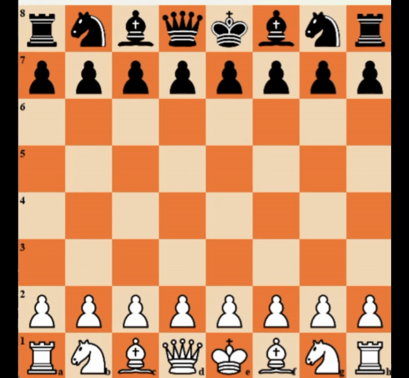

<p align="center">
  
</p>

---

<h1 align="center"><em>PTIT_chess – Trò chơi cờ vua tích hợp Agent AI</em></h1>

## 🎯 Bài toán đề ra:
- **Mục tiêu**: Xây dựng một game cờ vua có giao diện đồ họa đơn giản, cho phép người chơi với máy (AI).  
- **Yêu cầu**:
  - Hiển thị bàn cờ 8×8, quản lý trạng thái bằng mảng 2 chiều (`board[row][col]`), xây dựng luật lệ trong trò chơi giống với luật cờ vua thực tế.
  - Người chời thực hiện nước đi bằng chuột khi đến lượt của mình
  - Khi người chơi thực hiện xong nước đi AI thực hiện nước đi tốt nhất, hiện lên giao diện sau khi chạy xong thuật toán.
  - Người chơi và AI sẽ thực hiện nước đi lần lượt cho đến khi một bên bị chiếu hết hoặc hòa cờ thì trò chơi kết thúc.

---

## 📊 Bản thử nghiệm:
<p align="center">
  
</p>

---

## 🛠️ Giải pháp đã chọn:
0. **Ngôn ngữ lập trình: Python 🐍**
1. **Giao diện: Pygame 💻**:  
   - Khởi tạo cửa sổ, vẽ bàn cờ và quân cờ dưới dạng hình vuông và hình ảnh PNG.  
   - Xử lý sự kiện bàn phím và chuột để nhập nước đi.

2. **Luật lệ & nước đi 📘**:  
   - Lưu cấu trúc `board` dưới dạng mảng 2 chiều 8×8, mỗi ô là `"wK"`, `"bQ"`, `"--"`…  
   - Thiết kế Hàm sinh và kiểm tra nước đi hợp lệ, áp dụng/hoán đổi nước đi, phát hiện chiếu hết hoặc hòa cờ.

3. **Thuật toán & AI – Negamax + Alpha–Beta + Quiescence search**:  
   - Áp dụng thuật toán `Negamax + Alpha–Beta + Quiescence search` cùng với hàm đánh giá `heuristic` để tính toán điểm số ở các nút, ngoài ra thực hiện sắp xếp `MVV-LVA`cho nước đi trước khi chạy thuật toán.

---

## 📊 Lưu đồ giải thuật:
*ảnh

---

## 🚀 Hướng dẫn cài đặt trò chơi:
```bash
# 1. Clone repository
git clone https://github.com/minh7709/PTIT_chess.git
cd PTIT_chess/chess

# 2. Tạo virtual environment và cài đặt dependencies
python -m venv venv
source venv/bin/activate    # Linux/Mac
venv\Scripts\activate       # Windows
pip install -r requirements.txt

# 3. Khởi động trò chơi (mặc định: quân trắng là người chơi, quân đen là máy)
python ChessMain.py
```
---